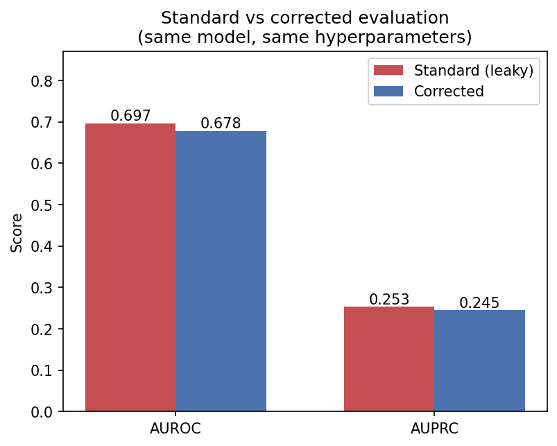

# Can we honestly predict which hospital patients will come back — and explain why?

## Why this exists

When a patient leaves the hospital, care teams want to know who is most likely
to end up back there within a few weeks. Getting that right matters: hospitals
are penalized for too many early returns, and teams have limited time to follow
up with the people at highest risk. Machine learning is often pitched as the
answer — score every discharge, flag the riskiest patients, maybe even generate
a short “why this patient” note for the clinician.

In practice, that story breaks in two places. First, many public demos of these
models look more accurate than they really are because the evaluation quietly
cheats (for example, by letting the same patient appear in both training and
testing). Second, once a model exists, Gen AI can write fluent explanations of
its predictions — but fluent is not the same as faithful. An explanation that
sounds clinical while inventing factors or flipping risk directions can do real
harm in a care setting.

This project is a hands-on showcase of **machine learning and Gen AI used the
way they need to work for impact**, not just a leaderboard score:

1. **Build a real predictive model** for early hospital return on a well-known
   public dataset.
2. **Evaluate it honestly** — reproduce the common (leaky) setup, fix the
   mistakes, and show how much the headline number was inflated.
3. **Add a Gen AI explanation layer** on top of the model, then **audit** whether
   those explanations actually match what the model used.

The point is not that a fancier algorithm wins. The point is that **trustworthy
evaluation and faithful explanations** are what separate a demo from something a
health system could responsibly consider.

---

## What changed when we evaluated honestly

Same model (LightGBM), same hyperparameters. The only changes are a
patient-grouped split instead of a leaky stratified one, and a cohort that
excludes patients who could not be readmitted (expired/hospice discharges).

| Evaluation | AUROC | AUPRC | Patient leakage |
|---|---|---|---|
| **Standard** (stratified split, naive cohort) | **0.697** | 0.253 | 38% of test patients also in train |
| **Corrected** (grouped split, cohort fix) | **0.678** | 0.245 | 0 |

The standard evaluation reports **AUROC 0.697**. With patient-level splits and a
corrected cohort, the identical model scores **0.678** — and the corrected number
lands squarely in the published 0.63–0.67 range, while much public work quotes
the inflated figure.



Isolating each trap (2×2 ablation, section 4a of the analysis notebook):

| Cohort | Split | AUROC | Note |
|---|---|---|---|
| naive | stratified | 0.697 | the standard, leaky setup |
| naive | grouped | 0.680 | **leakage alone ≈ 0.016 AUROC** |
| corrected | stratified | 0.679 | |
| corrected | grouped | 0.678 | both traps fixed |

Patient-level leakage is the dominant trap; the cohort fix mostly shifts the
base rate and honesty of the negatives.

---

## Can Gen AI explain the prediction without making things up?

A risk score alone is hard to act on. Clinicians also want a short reason —
“why is this patient flagged?” Here an LLM writes that narrative from the
model’s real risk drivers (SHAP), and a **separate** pass audits whether the
story stays faithful. On 50 audited explanations of the corrected model:

| Generator prompt | Explanations reversing a risk direction | Reversal rate (per claim) | Invented-feature rate |
|---|---|---|---|
| Naive ("discuss only the drivers") | 10.0% | 0.018 | 0.183 |
| **Grounded** (drivers + feature glossary + strict rules) | **2.0%** | **0.003** | **0.028** |

Fluent explanations are *mostly* faithful — but only once the prompt is
explicitly grounded in the model's real features and audited. A naive prompt
invented a clinical factor in ~18% of references and flipped a risk direction in
1 of 10 explanations; grounding the prompt (and giving the extractor the same
glossary) cut both by ~6×. From `genai_audit.ipynb` (Phase 4, needs an OpenAI
key). See [Explanation-audit methodology](#explanation-audit-methodology).

---

## Honest limitations

- **Data is from 1999–2008.** Fine for a methods project; no claim of clinical currency.
- **Diabetic inpatients only, single data warehouse** (Health Facts / Cerner) — not a general population.
- **No clinical notes**, so the gen AI layer audits *explanation faithfulness* rather than doing extraction.

---

## How to run

Everything is two notebooks: **`data_prep.ipynb`** (all data handling) and
**`readmission_analysis.ipynb`** (the whole ML analysis, top to bottom). The
analysis notebook pulls in the data-prep one with `%run data_prep.ipynb`.

**In Jupyter (recommended):**

```bash
make setup      # venv + pinned dependencies
make kernel     # register the venv as a Jupyter kernel
.venv/bin/jupyter lab
```

Open `readmission_analysis.ipynb`, pick the **"Python (readmission-eval)"**
kernel, and Run All. It reads the CSV, builds the cohort, trains, and evaluates
inline.

**Headless (reproduce everything from the terminal):**

```bash
make all        # download data + execute the analysis notebook end to end
make test       # integrity guards (leakage / cohort / split)
```

**Optional gen AI layer (Phase 4):**

```bash
make setup-genai       # openai, instructor, pydantic, shap
cp .env.example .env    # add your OPENAI_API_KEY
# then run genai_audit.ipynb  (or: make genai)
```

---

<details>
<summary><b>Below the fold: cohort, leakage checks, features, full results, audit methodology</b></summary>

### Dataset

[Diabetes 130-US Hospitals for Years 1999–2008](https://archive.ics.uci.edu/dataset/296/diabetes+130-us+hospitals+for+years+1999-2008),
UCI ML Repository. 101,766 inpatient encounters, 71,518 unique patients
(≈1.42 encounters/patient — which is exactly why the split matters). Openly
licensed and de-identified, so commercial LLM APIs are permitted. Auto-downloaded
by `make data` via `ucimlrepo`.

### The three issues

**Issue 1: patient-level leakage.** Many patients have multiple encounters. A
stratified split on encounters puts the same `patient_nbr` in both train and
test (measured: **38% of test patients leaked**). Fix: `GroupShuffleSplit` on
`patient_nbr`. Never split on `encounter_id`. Verified by
`tests/test_integrity.py`.

**Issue 2: the cohort includes patients who could not be readmitted.**
`discharge_disposition_id` encodes expired and hospice discharges; a patient who
died is a guaranteed negative. We drop disposition IDs **11, 13, 14, 19, 20, 21**
(**2,423 rows**) in the corrected cohort and document it.

**Issue 3: label binarization.** `readmitted` is three-class. HRRP is a 30-day
program, so the target is `<30` = 1, `{>30, NO}` = 0. Base rate ≈ **11.2%**.

### Data-quality handling

- `weight` (~97% missing) → dropped, not imputed.
- `payer_code`, `medical_specialty`, `race` → missingness kept as its own
  category (needed for the fairness audit; rows not dropped).
- ICD-9 `diag_1..3` (700+ codes) → grouped into the 9 clinical categories from
  Strack et al. (2014), not one-hot encoded.
- Zero-variance columns (`examide`, `citoglipton`) → dropped programmatically.

### Full results (corrected model)

**Discrimination & calibration.** AUROC 0.678, AUPRC 0.245 (base rate 0.112),
Brier 0.094, calibration slope 0.95 — well calibrated, unusually for this
dataset. (Notebook section 4b.)

**Baselines vs boosted model** (notebook section 4d):

| Model | AUROC | AUPRC | precision@50 |
|---|---|---|---|
| `number_inpatient` alone | 0.602 | 0.172 | **0.56** |
| Logistic regression | 0.666 | 0.220 | 0.52 |
| LightGBM | 0.678 | 0.245 | **0.56** |

Gradient boosting beats logistic regression by only ~0.012 AUROC, and a
**single feature — prior inpatient visits — matches LightGBM on precision@50**.
That is a real finding, not a footnote.

**Global feature importance** (notebook section 4e). Biggest drivers of the
corrected model by mean |SHAP| (LightGBM gain agrees on the top two):

| Feature | mean \|SHAP\| |
|---|---|
| `number_inpatient` (prior inpatient stays) | 0.29 |
| `discharge_disposition_id` (where discharged to) | 0.22 |
| `medical_specialty` | 0.11 |
| `diag_1_group` (primary diagnosis) | 0.08 |
| `payer_code` (insurance) | 0.08 |
| `age` | 0.07 |
| `number_diagnoses` | 0.07 |
| `num_medications` | 0.05 |

Prior utilization dominates — consistent with `number_inpatient` alone nearly
matching the full model above. (Magnitude only; per-patient *direction* is what
Phase 4 audits.)

**Clinical utility.** precision@k framing: of the 50 highest-risk patients a
care team could contact in a week, ~56% would actually have been readmitted — a
**5× lift** over the base rate. (Notebook section 4c, with the decision curve.)

**Temporal validation.** Holding out later encounters (an encounter-order proxy;
the dataset has no explicit dates) drops AUROC to **0.653**. Note this proxy is
confounded: later patients skew toward single-visit, low-utilization cases that
are inherently harder to predict, so the drop mixes true dataset shift with a
composition shift. (Notebook section 4g.)

**Subgroup / fairness audit** (notebook section 4f). Worst-vs-best AUROC gaps:
age 0.31 (driven by small extreme-age groups), payer_code 0.17, race 0.16,
gender 0.02.

### Explanation-audit methodology

Phase 4 separates generation from auditing so the checks are honest:

1. LightGBM predicts → SHAP gives per-patient signed top-k drivers.
2. An LLM writes a free-text clinician explanation from those drivers. The
   prompt is **grounded**: each driver is paired with a plain-English glossary
   entry, and the model is told to use only the listed factors, keep each
   direction exactly, and give no recommendations.
3. A **separate** structured pass parses the prose back into
   (feature, stated-direction) claims + unsupported clinical assertions. It
   receives the same glossary so genuine rephrasings map to canonical features
   rather than counting as invented.
4. Four countable checks vs the SHAP ground truth: **feature grounding**
   (invented-feature rate), **direction fidelity** (reversal rate — the
   headline), **unsupported clinical claims**, and **stability** (same patient,
   repeated temp-0 runs).

### Reproducibility

Fixed seeds, pinned dependencies (`requirements.txt`), `make` targets, and an
integrity test suite (`make test`) that fails if either trap reappears.

### Project layout

```
data_prep.ipynb              THE data notebook: constants + read CSV -> cohort
                             (traps 2 & 3) -> features -> split (trap 1)
readmission_analysis.ipynb   THE ML: read -> prep -> train -> evaluate, top to
                             bottom (Phases 1-3); starts with %run data_prep.ipynb
genai_audit.ipynb            optional Phase 4: SHAP -> LLM -> faithfulness audit
tests/                       leakage / cohort / split integrity guards
requirements.txt             pinned dependencies
```

</details>

---

*Methods project. Not for clinical use. Dataset: Strack et al., "Impact of HbA1c
Measurement on Hospital Readmission Rates," BioMed Research International, 2014.*
